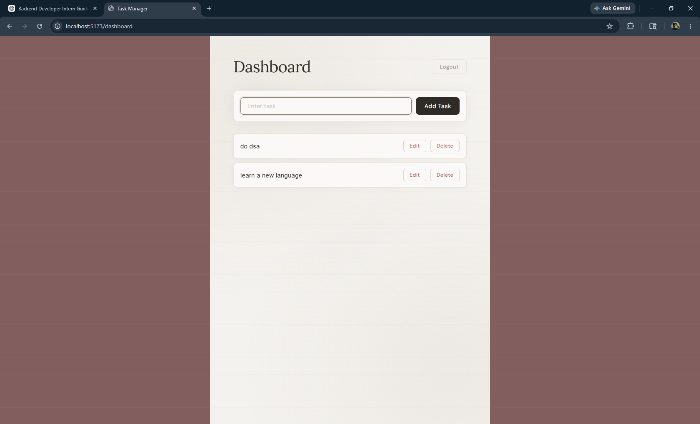
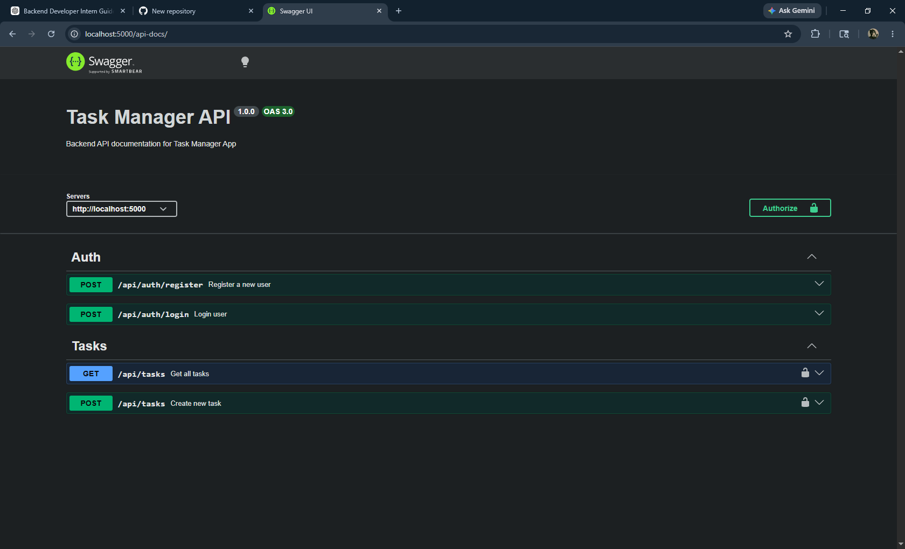

# 🚀 Task Manager API

<p align="center">


</p>

<p align="center">
A scalable full-stack task management application featuring secure JWT authentication, role-based authorization, RESTful APIs, and complete task CRUD operations.
</p>

---

# ✨ Features

✅ User Registration & Login  
✅ Secure JWT Authentication  
✅ Password Encryption using bcryptjs  
✅ Protected Routes & Middleware  
✅ Role-Based Access Control (RBAC)  
✅ Full CRUD Functionality for Tasks  
✅ RESTful API Architecture  
✅ Swagger API Documentation  
✅ Responsive React Frontend  
✅ MongoDB Database Integration  
✅ Secure HTTP Headers using Helmet  
✅ Cross-Origin Support with CORS  
✅ Request Logging using Morgan  

---

# 🛠️ Tech Stack

## ⚙️ Backend

- 🟢 Node.js
- ⚡ Express.js
- 🍃 MongoDB
- 📦 Mongoose
- 🔐 JWT Authentication
- 🔒 bcryptjs
- 📄 Swagger UI
- 🛡️ Helmet
- 🌐 CORS
- 📑 Morgan

---

## 🎨 Frontend

- ⚛️ React.js
- 🛣️ React Router DOM
- 📡 Axios
- ⚡ Vite

---

# 📸 Project Preview

## 🔐 Login Page


---

## 📝 Register Page


---

## 📋 Dashboard



---

## 📚 Swagger API Documentation



---

# 🌐 Live Demo

### 🚀 Frontend
https://task-management-f.netlify.app

### ⚙️ Backend API
https://taskmanager-4v87.onrender.com

### 📚 Swagger Docs
https://taskmanager-4v87.onrender.com/api-docs

---

# ⚙️ Installation

## 📥 Clone Repository

```bash
git clone your_repo_url
```

---

## 🔧 Backend Setup

```bash
cd backend
npm install
npm run dev
```

---

## 🎨 Frontend Setup

```bash
cd frontend
npm install
npm run dev
```

---

# 🔐 Environment Variables

Create a `.env` file inside the backend folder:

```env
PORT=5000
MONGO_URI=your_mongodb_uri
JWT_SECRET=your_secret_key
```

---

# 📚 API Documentation

Swagger API Documentation:

```txt
https://taskmanager-4v87.onrender.com/api-docs
```

---

# 🏗️ Scalability & Architecture

✨ Modular backend architecture  
✨ JWT-based stateless authentication  
✨ Middleware-driven authorization  
✨ RESTful API design principles  
✨ Separate frontend/backend architecture  
✨ Centralized error handling  
✨ Easily scalable for microservices  
✨ Secure HTTP headers with Helmet  

---

# 📂 Folder Structure

```bash
TaskManager/
│
├── backend/
│   ├── config/
│   │   └── db.js
│   │
│   ├── controllers/
│   │   ├── authController.js
│   │   └── taskController.js
│   │
│   ├── middleware/
│   │   ├── authMiddleware.js
│   │   ├── roleMiddleware.js
│   │   └── errorMiddleware.js
│   │
│   ├── models/
│   │   ├── User.js
│   │   └── Task.js
│   │
│   ├── routes/
│   │   ├── authRoutes.js
│   │   └── taskRoutes.js
│   │
│   ├── swagger/
│   │   └── swagger.js
│   │
│   ├── .env
│   ├── package.json
│   ├── package-lock.json
│   └── server.js
│
├── frontend/
│   ├── public/
│   │   └── _redirects
│   │
│   ├── src/
│   │   ├── components/
│   │   │   ├── Navbar.jsx
│   │   │   ├── ProtectedRoute.jsx
│   │   │   └── TaskCard.jsx
│   │   │
│   │   ├── pages/
│   │   │   ├── Login.jsx
│   │   │   ├── Register.jsx
│   │   │   └── Dashboard.jsx
│   │   │
│   │   ├── services/
│   │   │   └── api.js
│   │   │
│   │   ├── context/
│   │   │   └── AuthContext.jsx
│   │   │
│   │   ├── App.jsx
│   │   ├── main.jsx
│   │   └── index.css
│   │
│   ├── package.json
│   ├── package-lock.json
│   └── vite.config.js
│
├── login.png
├── register.png
├── dashboard.png
├── swagger.png
├── .gitignore
└── README.md
```

---

# 👨‍💻 Author

## Divyanshu Bisht

🔗 GitHub  
https://github.com/Divyanshu-bisht

💼 LinkedIn  
https://linkedin.com/in/divyanshubisht

---

# ⭐ Support

If you found this project useful, consider giving it a ⭐ on GitHub!
